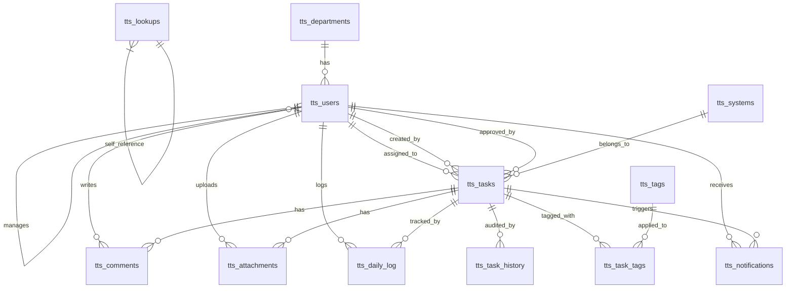

# Daily Tasks Tracking System (TTS) — Revised Implementation Plan
### Oracle APEX 24.2.17 | Full-Stack Design Document (v2.0)

---

## Overview

A comprehensive Daily Tasks Tracking System built on Oracle APEX 24.2.17 that enables employees to log daily work, managers to supervise and approve tasks, and administrators to manage the entire lifecycle. The system includes custom authentication, role-based authorization, approval workflows, kanban boards, graphical dashboards, file attachments, comments, notifications, and daily time logging.

---

## User Review Required

> [!IMPORTANT]
> - **Privilege:** The DB schema user must have `EXECUTE` on `DBMS_CRYPTO` and `APEX_MAIL`.
> - **SMTP:** Ensure APEX Instance SMTP settings are configured for email notifications.
> - **Theme:** We will use **Universal Theme (Theme 42)** with custom CSS overrides for branding.

---

## Part 1: Database Schema Design

All DDL scripts will be written to: [schema.sql](file:///c:/Users/develop4/Documents/Tasks%20system/schema.sql)

---

### 1.1 Lookup Table (القيم المرجعية)

Replaces hard-coded CHECK constraints with a flexible, admin-manageable lookup table. Any future values (new status, new priority, etc.) can be added without `ALTER TABLE`.

```sql
CREATE TABLE tts_lookups (
    lookup_id     NUMBER GENERATED BY DEFAULT AS IDENTITY PRIMARY KEY,
    lookup_type   VARCHAR2(50)  NOT NULL,  -- 'TASK_STATUS', 'PRIORITY', 'APPROVAL_STATUS', 'NOTIFICATION_TYPE'
    lookup_code   VARCHAR2(50)  NOT NULL,
    display_name  VARCHAR2(100) NOT NULL,
    display_name_ar VARCHAR2(100),         -- Arabic label (optional bilingual support)
    display_order NUMBER DEFAULT 0,
    is_active     CHAR(1) DEFAULT 'Y' NOT NULL CHECK (is_active IN ('Y', 'N')),
    CONSTRAINT uk_lookups UNIQUE (lookup_type, lookup_code)
);

-- Seed Data: Task Statuses
INSERT INTO tts_lookups (lookup_type, lookup_code, display_name, display_name_ar, display_order) VALUES
('TASK_STATUS', 'CREATED',     'Created',     'جديدة',       1);
INSERT INTO tts_lookups (lookup_type, lookup_code, display_name, display_name_ar, display_order) VALUES
('TASK_STATUS', 'IN_PROGRESS', 'In Progress', 'قيد التنفيذ', 2);
INSERT INTO tts_lookups (lookup_type, lookup_code, display_name, display_name_ar, display_order) VALUES
('TASK_STATUS', 'ON_HOLD',     'On Hold',     'معلقة',       3);
INSERT INTO tts_lookups (lookup_type, lookup_code, display_name, display_name_ar, display_order) VALUES
('TASK_STATUS', 'COMPLETED',   'Completed',   'مكتملة',      4);
INSERT INTO tts_lookups (lookup_type, lookup_code, display_name, display_name_ar, display_order) VALUES
('TASK_STATUS', 'CANCELLED',   'Cancelled',   'ملغاة',       5);

-- Seed Data: Priorities
INSERT INTO tts_lookups (lookup_type, lookup_code, display_name, display_name_ar, display_order) VALUES
('PRIORITY', 'LOW',      'Low',      'منخفضة',  1);
INSERT INTO tts_lookups (lookup_type, lookup_code, display_name, display_name_ar, display_order) VALUES
('PRIORITY', 'MEDIUM',   'Medium',   'متوسطة',  2);
INSERT INTO tts_lookups (lookup_type, lookup_code, display_name, display_name_ar, display_order) VALUES
('PRIORITY', 'HIGH',     'High',     'عالية',   3);
INSERT INTO tts_lookups (lookup_type, lookup_code, display_name, display_name_ar, display_order) VALUES
('PRIORITY', 'CRITICAL', 'Critical', 'حرجة',    4);

-- Seed Data: Approval Statuses
INSERT INTO tts_lookups (lookup_type, lookup_code, display_name, display_name_ar, display_order) VALUES
('APPROVAL_STATUS', 'NOT_SUBMITTED', 'Not Submitted', 'لم تُقدَّم',   1);
INSERT INTO tts_lookups (lookup_type, lookup_code, display_name, display_name_ar, display_order) VALUES
('APPROVAL_STATUS', 'PENDING',       'Pending',       'في الانتظار', 2);
INSERT INTO tts_lookups (lookup_type, lookup_code, display_name, display_name_ar, display_order) VALUES
('APPROVAL_STATUS', 'APPROVED',      'Approved',      'مُعتمدة',     3);
INSERT INTO tts_lookups (lookup_type, lookup_code, display_name, display_name_ar, display_order) VALUES
('APPROVAL_STATUS', 'REJECTED',      'Rejected',      'مرفوضة',      4);

COMMIT;
```

---

### 1.2 Departments Table (الأقسام)

```sql
CREATE TABLE tts_departments (
    dept_id      NUMBER GENERATED BY DEFAULT AS IDENTITY PRIMARY KEY,
    dept_name    VARCHAR2(100) UNIQUE NOT NULL,
    dept_head_id NUMBER,                       -- FK added after tts_users creation
    is_active    CHAR(1) DEFAULT 'Y' NOT NULL CHECK (is_active IN ('Y', 'N')),
    created_at   TIMESTAMP DEFAULT SYSTIMESTAMP NOT NULL,
    updated_at   TIMESTAMP DEFAULT SYSTIMESTAMP NOT NULL
);
```

---

### 1.3 Users Table (المستخدمين)

```sql
CREATE TABLE tts_users (
    user_id       NUMBER GENERATED BY DEFAULT AS IDENTITY PRIMARY KEY,
    username      VARCHAR2(50)  UNIQUE NOT NULL,
    password_hash VARCHAR2(256) NOT NULL,
    password_salt VARCHAR2(128) NOT NULL,       -- ✅ Salt for secure hashing
    email         VARCHAR2(100) UNIQUE NOT NULL,
    full_name     VARCHAR2(150) NOT NULL,
    role          VARCHAR2(20)  NOT NULL,       -- 'ADMIN', 'MANAGER', 'EMPLOYEE'
    dept_id       NUMBER,                       -- ✅ Department link
    manager_id    NUMBER,                       -- Direct manager (hierarchy)
    is_active     CHAR(1) DEFAULT 'Y' NOT NULL CHECK (is_active IN ('Y', 'N')),
    last_login    TIMESTAMP,
    created_at    TIMESTAMP DEFAULT SYSTIMESTAMP NOT NULL,
    updated_at    TIMESTAMP DEFAULT SYSTIMESTAMP NOT NULL,
    CONSTRAINT fk_users_dept    FOREIGN KEY (dept_id)    REFERENCES tts_departments(dept_id),
    CONSTRAINT fk_users_manager FOREIGN KEY (manager_id) REFERENCES tts_users(user_id)
);

-- Now add the dept_head FK
ALTER TABLE tts_departments ADD CONSTRAINT fk_dept_head 
    FOREIGN KEY (dept_head_id) REFERENCES tts_users(user_id);
```

---

### 1.4 Systems Table (الأنظمة)

```sql
CREATE TABLE tts_systems (
    system_id    NUMBER GENERATED BY DEFAULT AS IDENTITY PRIMARY KEY,
    system_name  VARCHAR2(100) UNIQUE NOT NULL,
    description  VARCHAR2(4000),
    is_active    CHAR(1) DEFAULT 'Y' NOT NULL CHECK (is_active IN ('Y', 'N')),
    created_at   TIMESTAMP DEFAULT SYSTIMESTAMP NOT NULL,
    updated_at   TIMESTAMP DEFAULT SYSTIMESTAMP NOT NULL
);
```

---

### 1.5 Tasks Table (المهام)

```sql
CREATE TABLE tts_tasks (
    task_id          NUMBER GENERATED BY DEFAULT AS IDENTITY PRIMARY KEY,
    task_number      VARCHAR2(20) UNIQUE NOT NULL,  -- ✅ Human-readable ID: 'TSK-000001'
    title            VARCHAR2(250) NOT NULL,
    description      CLOB,
    system_id        NUMBER NOT NULL,
    assigned_to      NUMBER NOT NULL,
    created_by       NUMBER NOT NULL,
    status           VARCHAR2(20) DEFAULT 'CREATED' NOT NULL,
    priority         VARCHAR2(20) DEFAULT 'MEDIUM'  NOT NULL,
    start_date       DATE NOT NULL,
    due_date         DATE NOT NULL,
    estimated_hours  NUMBER(6,2)  NOT NULL,
    actual_hours     NUMBER(6,2)  DEFAULT 0,        -- ✅ Auto-calculated from tts_daily_log
    completion_date  DATE,
    approval_status  VARCHAR2(20) DEFAULT 'NOT_SUBMITTED' NOT NULL,  -- ✅ Fixed default
    approved_by      NUMBER,
    approval_notes   VARCHAR2(4000),                 -- ✅ Approval/Rejection reason
    created_at       TIMESTAMP DEFAULT SYSTIMESTAMP NOT NULL,
    updated_at       TIMESTAMP DEFAULT SYSTIMESTAMP NOT NULL,
    CONSTRAINT fk_tasks_system   FOREIGN KEY (system_id)   REFERENCES tts_systems(system_id),
    CONSTRAINT fk_tasks_assigned FOREIGN KEY (assigned_to) REFERENCES tts_users(user_id),
    CONSTRAINT fk_tasks_creator  FOREIGN KEY (created_by)  REFERENCES tts_users(user_id),
    CONSTRAINT fk_tasks_approver FOREIGN KEY (approved_by) REFERENCES tts_users(user_id),
    CONSTRAINT chk_dates         CHECK (due_date >= start_date),
    CONSTRAINT chk_est_hours     CHECK (estimated_hours >= 0),
    CONSTRAINT chk_act_hours     CHECK (actual_hours >= 0)
);
```

---

### 1.6 Daily Time Log (سجل الساعات اليومية)

```sql
CREATE TABLE tts_daily_log (
    log_id       NUMBER GENERATED BY DEFAULT AS IDENTITY PRIMARY KEY,
    task_id      NUMBER NOT NULL,
    user_id      NUMBER NOT NULL,
    log_date     DATE   NOT NULL,
    hours_spent  NUMBER(4,2) NOT NULL,
    notes        VARCHAR2(4000),
    created_at   TIMESTAMP DEFAULT SYSTIMESTAMP NOT NULL,
    CONSTRAINT fk_log_task FOREIGN KEY (task_id) REFERENCES tts_tasks(task_id) ON DELETE CASCADE,
    CONSTRAINT fk_log_user FOREIGN KEY (user_id) REFERENCES tts_users(user_id),
    CONSTRAINT chk_log_hours CHECK (hours_spent > 0 AND hours_spent <= 24),
    CONSTRAINT uk_daily_log  UNIQUE (task_id, user_id, log_date)
);
```

---

### 1.7 Comments Table (التعليقات)

```sql
CREATE TABLE tts_comments (
    comment_id   NUMBER GENERATED BY DEFAULT AS IDENTITY PRIMARY KEY,
    task_id      NUMBER NOT NULL,
    user_id      NUMBER NOT NULL,
    comment_text CLOB   NOT NULL,
    created_at   TIMESTAMP DEFAULT SYSTIMESTAMP NOT NULL,
    CONSTRAINT fk_comments_task FOREIGN KEY (task_id) REFERENCES tts_tasks(task_id) ON DELETE CASCADE,
    CONSTRAINT fk_comments_user FOREIGN KEY (user_id) REFERENCES tts_users(user_id)
);
```

---

### 1.8 Attachments Table (المرفقات)

```sql
CREATE TABLE tts_attachments (
    attachment_id NUMBER GENERATED BY DEFAULT AS IDENTITY PRIMARY KEY,
    task_id       NUMBER NOT NULL,
    file_name     VARCHAR2(255) NOT NULL,
    file_mimetype VARCHAR2(100) NOT NULL,
    file_blob     BLOB          NOT NULL,
    file_charset  VARCHAR2(100),
    uploaded_by   NUMBER NOT NULL,
    uploaded_at   TIMESTAMP DEFAULT SYSTIMESTAMP NOT NULL,
    CONSTRAINT fk_attach_task FOREIGN KEY (task_id)     REFERENCES tts_tasks(task_id) ON DELETE CASCADE,
    CONSTRAINT fk_attach_user FOREIGN KEY (uploaded_by) REFERENCES tts_users(user_id)
);
```

---

### 1.9 Tags System (الوسوم)

```sql
CREATE TABLE tts_tags (
    tag_id   NUMBER GENERATED BY DEFAULT AS IDENTITY PRIMARY KEY,
    tag_name VARCHAR2(50) UNIQUE NOT NULL
);

CREATE TABLE tts_task_tags (
    task_id NUMBER NOT NULL,
    tag_id  NUMBER NOT NULL,
    CONSTRAINT pk_task_tags   PRIMARY KEY (task_id, tag_id),
    CONSTRAINT fk_ttags_task  FOREIGN KEY (task_id) REFERENCES tts_tasks(task_id) ON DELETE CASCADE,
    CONSTRAINT fk_ttags_tag   FOREIGN KEY (tag_id)  REFERENCES tts_tags(tag_id)   ON DELETE CASCADE
);
```

---

### 1.10 Task History / Audit Trail (سجل التغييرات)

```sql
CREATE TABLE tts_task_history (
    history_id   NUMBER GENERATED BY DEFAULT AS IDENTITY PRIMARY KEY,
    task_id      NUMBER NOT NULL,
    changed_by   NUMBER NOT NULL,
    changed_at   TIMESTAMP DEFAULT SYSTIMESTAMP NOT NULL,
    change_type  VARCHAR2(50) NOT NULL,  -- 'STATUS', 'ASSIGNMENT', 'PRIORITY', 'APPROVAL', etc.
    old_value    VARCHAR2(4000),
    new_value    VARCHAR2(4000),
    CONSTRAINT fk_hist_task FOREIGN KEY (task_id)    REFERENCES tts_tasks(task_id) ON DELETE CASCADE,
    CONSTRAINT fk_hist_user FOREIGN KEY (changed_by) REFERENCES tts_users(user_id)
);
```

---

### 1.11 Notifications Table (الإشعارات)

```sql
CREATE TABLE tts_notifications (
    notification_id   NUMBER GENERATED BY DEFAULT AS IDENTITY PRIMARY KEY,
    user_id           NUMBER NOT NULL,
    task_id           NUMBER,
    notification_type VARCHAR2(50)   NOT NULL,  -- 'TASK_ASSIGNED', 'STATUS_CHANGED', 'APPROVAL_REQUIRED', 'APPROVAL_RESULT'
    message           VARCHAR2(4000) NOT NULL,
    is_read           CHAR(1) DEFAULT 'N' NOT NULL CHECK (is_read IN ('Y', 'N')),
    email_sent        CHAR(1) DEFAULT 'N' NOT NULL CHECK (email_sent IN ('Y', 'N')),
    created_at        TIMESTAMP DEFAULT SYSTIMESTAMP NOT NULL,
    CONSTRAINT fk_notif_user FOREIGN KEY (user_id) REFERENCES tts_users(user_id),
    CONSTRAINT fk_notif_task FOREIGN KEY (task_id)  REFERENCES tts_tasks(task_id) ON DELETE SET NULL
);
```

---

### 1.12 Performance Indexes

```sql
-- Users
CREATE INDEX idx_users_manager    ON tts_users(manager_id);
CREATE INDEX idx_users_dept       ON tts_users(dept_id);
CREATE INDEX idx_users_role       ON tts_users(role);

-- Tasks (most critical for performance)
CREATE INDEX idx_tasks_assigned   ON tts_tasks(assigned_to);
CREATE INDEX idx_tasks_created_by ON tts_tasks(created_by);
CREATE INDEX idx_tasks_status     ON tts_tasks(status);
CREATE INDEX idx_tasks_system     ON tts_tasks(system_id);
CREATE INDEX idx_tasks_priority   ON tts_tasks(priority);
CREATE INDEX idx_tasks_dates      ON tts_tasks(start_date, due_date);
CREATE INDEX idx_tasks_approval   ON tts_tasks(approval_status);

-- Supporting tables
CREATE INDEX idx_daily_log_task   ON tts_daily_log(task_id);
CREATE INDEX idx_daily_log_user   ON tts_daily_log(user_id);
CREATE INDEX idx_daily_log_date   ON tts_daily_log(log_date);
CREATE INDEX idx_comments_task    ON tts_comments(task_id);
CREATE INDEX idx_history_task     ON tts_task_history(task_id);
CREATE INDEX idx_notif_user       ON tts_notifications(user_id);
CREATE INDEX idx_notif_read       ON tts_notifications(user_id, is_read);
```

---

### 1.13 Sequences (Task Number Generator)

```sql
CREATE SEQUENCE tts_task_number_seq START WITH 1 INCREMENT BY 1 NOCACHE;
```

---

## Part 2: Database Views

All views will be written to: [views.sql](file:///c:/Users/develop4/Documents/Tasks%20system/views.sql)

### 2.1 `v_tasks_full` — Master Task View

```sql
CREATE OR REPLACE VIEW v_tasks_full AS
SELECT 
    t.task_id, t.task_number, t.title, t.description,
    t.status, 
    ls.display_name AS status_display,
    t.priority, 
    lp.display_name AS priority_display,
    t.start_date, t.due_date, t.estimated_hours, t.actual_hours,
    t.completion_date,
    t.approval_status, 
    la.display_name AS approval_display,
    t.approval_notes,
    t.created_at, t.updated_at,
    -- System
    s.system_id, s.system_name,
    -- Assigned To
    ua.user_id AS assigned_to_id, ua.full_name AS assigned_to_name, ua.username AS assigned_to_user,
    -- Created By
    uc.user_id AS created_by_id, uc.full_name AS created_by_name,
    -- Approver
    uap.full_name AS approved_by_name,
    -- Manager of assigned user
    ua.manager_id,
    -- Computed
    CASE WHEN t.due_date < TRUNC(SYSDATE) AND t.status NOT IN ('COMPLETED','CANCELLED') 
         THEN 'Y' ELSE 'N' END AS is_overdue,
    TRUNC(t.due_date) - TRUNC(SYSDATE) AS days_remaining,
    -- Comments & Attachments count
    (SELECT COUNT(*) FROM tts_comments c WHERE c.task_id = t.task_id) AS comments_count,
    (SELECT COUNT(*) FROM tts_attachments a WHERE a.task_id = t.task_id) AS attachments_count
FROM tts_tasks t
JOIN tts_systems s   ON s.system_id  = t.system_id
JOIN tts_users ua    ON ua.user_id   = t.assigned_to
JOIN tts_users uc    ON uc.user_id   = t.created_by
LEFT JOIN tts_users uap ON uap.user_id = t.approved_by
LEFT JOIN tts_lookups ls ON ls.lookup_type = 'TASK_STATUS'     AND ls.lookup_code = t.status
LEFT JOIN tts_lookups lp ON lp.lookup_type = 'PRIORITY'        AND lp.lookup_code = t.priority
LEFT JOIN tts_lookups la ON la.lookup_type = 'APPROVAL_STATUS' AND la.lookup_code = t.approval_status;
```

### 2.2 `v_user_workload` — Employee Workload Summary

```sql
CREATE OR REPLACE VIEW v_user_workload AS
SELECT 
    u.user_id, u.full_name, u.username, u.role,
    d.dept_name,
    COUNT(t.task_id) AS total_tasks,
    SUM(CASE WHEN t.status = 'CREATED'     THEN 1 ELSE 0 END) AS created_count,
    SUM(CASE WHEN t.status = 'IN_PROGRESS' THEN 1 ELSE 0 END) AS in_progress_count,
    SUM(CASE WHEN t.status = 'ON_HOLD'     THEN 1 ELSE 0 END) AS on_hold_count,
    SUM(CASE WHEN t.status = 'COMPLETED'   THEN 1 ELSE 0 END) AS completed_count,
    SUM(CASE WHEN t.status = 'CANCELLED'   THEN 1 ELSE 0 END) AS cancelled_count,
    SUM(NVL(t.estimated_hours, 0)) AS total_estimated,
    SUM(NVL(t.actual_hours, 0))    AS total_actual,
    SUM(CASE WHEN t.due_date < TRUNC(SYSDATE) AND t.status NOT IN ('COMPLETED','CANCELLED') 
             THEN 1 ELSE 0 END) AS overdue_count
FROM tts_users u
LEFT JOIN tts_tasks t ON t.assigned_to = u.user_id
LEFT JOIN tts_departments d ON d.dept_id = u.dept_id
WHERE u.is_active = 'Y'
GROUP BY u.user_id, u.full_name, u.username, u.role, d.dept_name;
```

### 2.3 `v_overdue_tasks` — Overdue Tasks

```sql
CREATE OR REPLACE VIEW v_overdue_tasks AS
SELECT * FROM v_tasks_full
WHERE is_overdue = 'Y';
```

### 2.4 `v_dashboard_stats` — Dashboard Aggregation

```sql
CREATE OR REPLACE VIEW v_dashboard_stats AS
SELECT
    COUNT(*) AS total_tasks,
    SUM(CASE WHEN status = 'CREATED'     THEN 1 ELSE 0 END) AS created,
    SUM(CASE WHEN status = 'IN_PROGRESS' THEN 1 ELSE 0 END) AS in_progress,
    SUM(CASE WHEN status = 'ON_HOLD'     THEN 1 ELSE 0 END) AS on_hold,
    SUM(CASE WHEN status = 'COMPLETED'   THEN 1 ELSE 0 END) AS completed,
    SUM(CASE WHEN status = 'CANCELLED'   THEN 1 ELSE 0 END) AS cancelled,
    SUM(CASE WHEN approval_status = 'PENDING' THEN 1 ELSE 0 END) AS pending_approval,
    SUM(CASE WHEN due_date < TRUNC(SYSDATE) AND status NOT IN ('COMPLETED','CANCELLED') 
             THEN 1 ELSE 0 END) AS overdue,
    SUM(NVL(estimated_hours,0)) AS total_estimated_hours,
    SUM(NVL(actual_hours,0))    AS total_actual_hours
FROM tts_tasks;
```

### 2.5 `v_manager_team_tasks` — Manager's Team View

```sql
CREATE OR REPLACE VIEW v_manager_team_tasks AS
SELECT vt.*
FROM v_tasks_full vt
WHERE vt.manager_id IS NOT NULL;
-- Filtered in APEX query: WHERE vt.manager_id = :F_USER_ID OR vt.assigned_to_id = :F_USER_ID
```

---

## Part 3: PL/SQL Packages

All package code will be written to: [packages.sql](file:///c:/Users/develop4/Documents/Tasks%20system/packages.sql)

---

### 3.1 `tts_pkg_security` — Authentication & Authorization

```sql
CREATE OR REPLACE PACKAGE tts_pkg_security AS

    -- Generate random salt
    FUNCTION generate_salt RETURN VARCHAR2;

    -- Hash password with salt using DBMS_CRYPTO SHA-256
    FUNCTION hash_password(
        p_password IN VARCHAR2,
        p_salt     IN VARCHAR2
    ) RETURN VARCHAR2;

    -- Custom APEX Authentication Function (returns BOOLEAN)
    FUNCTION authenticate_user(
        p_username IN VARCHAR2,
        p_password IN VARCHAR2
    ) RETURN BOOLEAN;

    -- Post-Authentication: set APEX session items
    PROCEDURE post_auth(
        p_username IN VARCHAR2
    );

    -- Authorization check: can user perform action on task?
    FUNCTION can_user_edit_task(
        p_user_id IN NUMBER,
        p_task_id IN NUMBER
    ) RETURN BOOLEAN;

    -- Authorization check: is user a manager of the assignee?
    FUNCTION is_manager_of(
        p_manager_id  IN NUMBER,
        p_employee_id IN NUMBER
    ) RETURN BOOLEAN;

    -- Change password
    PROCEDURE change_password(
        p_user_id      IN NUMBER,
        p_old_password IN VARCHAR2,
        p_new_password IN VARCHAR2
    );

END tts_pkg_security;
/
```

---

### 3.2 `tts_pkg_tasks` — Task Lifecycle & Workflow

```sql
CREATE OR REPLACE PACKAGE tts_pkg_tasks AS

    -- Create a new task (generates task_number automatically)
    FUNCTION create_task(
        p_title          IN VARCHAR2,
        p_description    IN CLOB     DEFAULT NULL,
        p_system_id      IN NUMBER,
        p_assigned_to    IN NUMBER,
        p_created_by     IN NUMBER,
        p_priority       IN VARCHAR2 DEFAULT 'MEDIUM',
        p_start_date     IN DATE,
        p_due_date       IN DATE,
        p_estimated_hours IN NUMBER
    ) RETURN NUMBER;  -- returns task_id

    -- Update task status with validation & audit
    PROCEDURE update_task_status(
        p_task_id    IN NUMBER,
        p_new_status IN VARCHAR2,
        p_user_id    IN NUMBER
    );

    -- Reassign task to another user
    PROCEDURE reassign_task(
        p_task_id        IN NUMBER,
        p_new_assigned_to IN NUMBER,
        p_changed_by     IN NUMBER
    );

    -- Submit task for manager approval
    PROCEDURE submit_for_approval(
        p_task_id IN NUMBER,
        p_user_id IN NUMBER
    );

    -- Manager approves or rejects
    PROCEDURE process_approval(
        p_task_id    IN NUMBER,
        p_decision   IN VARCHAR2,  -- 'APPROVED' or 'REJECTED'
        p_manager_id IN NUMBER,
        p_notes      IN VARCHAR2 DEFAULT NULL
    );

    -- Log daily hours worked
    PROCEDURE log_daily_hours(
        p_task_id     IN NUMBER,
        p_user_id     IN NUMBER,
        p_log_date    IN DATE,
        p_hours_spent IN NUMBER,
        p_notes       IN VARCHAR2 DEFAULT NULL
    );

    -- Recalculate actual_hours from daily_log
    PROCEDURE recalc_actual_hours(
        p_task_id IN NUMBER
    );

    -- Add comment
    PROCEDURE add_comment(
        p_task_id      IN NUMBER,
        p_user_id      IN NUMBER,
        p_comment_text IN CLOB
    );

    -- Log history entry
    PROCEDURE log_history(
        p_task_id     IN NUMBER,
        p_changed_by  IN NUMBER,
        p_change_type IN VARCHAR2,
        p_old_value   IN VARCHAR2,
        p_new_value   IN VARCHAR2
    );

END tts_pkg_tasks;
/
```

---

### 3.3 `tts_pkg_notifications` — Notifications & Email

```sql
CREATE OR REPLACE PACKAGE tts_pkg_notifications AS

    -- Create in-app notification
    PROCEDURE create_notification(
        p_user_id   IN NUMBER,
        p_task_id   IN NUMBER   DEFAULT NULL,
        p_type      IN VARCHAR2,
        p_message   IN VARCHAR2
    );

    -- Send email notification via APEX_MAIL
    PROCEDURE send_email_notification(
        p_user_id  IN NUMBER,
        p_subject  IN VARCHAR2,
        p_body     IN CLOB
    );

    -- Mark notification as read
    PROCEDURE mark_as_read(
        p_notification_id IN NUMBER
    );

    -- Mark all notifications as read for a user
    PROCEDURE mark_all_read(
        p_user_id IN NUMBER
    );

    -- Get unread count (for badge display)
    FUNCTION get_unread_count(
        p_user_id IN NUMBER
    ) RETURN NUMBER;

END tts_pkg_notifications;
/
```

---

### 3.4 `tts_pkg_admin` — Admin & User Management

```sql
CREATE OR REPLACE PACKAGE tts_pkg_admin AS

    -- Register / Create User
    PROCEDURE create_user(
        p_username   IN VARCHAR2,
        p_password   IN VARCHAR2,
        p_email      IN VARCHAR2,
        p_full_name  IN VARCHAR2,
        p_role       IN VARCHAR2,
        p_dept_id    IN NUMBER   DEFAULT NULL,
        p_manager_id IN NUMBER   DEFAULT NULL
    );

    -- Activate / Deactivate user
    PROCEDURE toggle_user_status(
        p_user_id   IN NUMBER,
        p_is_active IN CHAR
    );

    -- Create / Update department
    PROCEDURE save_department(
        p_dept_id      IN NUMBER DEFAULT NULL,
        p_dept_name    IN VARCHAR2,
        p_dept_head_id IN NUMBER DEFAULT NULL
    );

    -- Create / Update system
    PROCEDURE save_system(
        p_system_id   IN NUMBER DEFAULT NULL,
        p_system_name IN VARCHAR2,
        p_description IN VARCHAR2 DEFAULT NULL
    );

END tts_pkg_admin;
/
```

---

### 3.5 Database Triggers

```sql
-- Auto-update updated_at timestamps
CREATE OR REPLACE TRIGGER trg_users_updated
    BEFORE UPDATE ON tts_users FOR EACH ROW
BEGIN
    :NEW.updated_at := SYSTIMESTAMP;
END;
/

CREATE OR REPLACE TRIGGER trg_tasks_updated
    BEFORE UPDATE ON tts_tasks FOR EACH ROW
BEGIN
    :NEW.updated_at := SYSTIMESTAMP;
END;
/

CREATE OR REPLACE TRIGGER trg_systems_updated
    BEFORE UPDATE ON tts_systems FOR EACH ROW
BEGIN
    :NEW.updated_at := SYSTIMESTAMP;
END;
/

CREATE OR REPLACE TRIGGER trg_depts_updated
    BEFORE UPDATE ON tts_departments FOR EACH ROW
BEGIN
    :NEW.updated_at := SYSTIMESTAMP;
END;
/

-- Auto-generate task_number on insert
CREATE OR REPLACE TRIGGER trg_task_number
    BEFORE INSERT ON tts_tasks FOR EACH ROW
BEGIN
    IF :NEW.task_number IS NULL THEN
        :NEW.task_number := 'TSK-' || LPAD(tts_task_number_seq.NEXTVAL, 6, '0');
    END IF;
END;
/

-- Auto-recalculate actual_hours when daily_log changes
CREATE OR REPLACE TRIGGER trg_daily_log_calc
    AFTER INSERT OR UPDATE OR DELETE ON tts_daily_log
    FOR EACH ROW
DECLARE
    v_task_id NUMBER;
BEGIN
    v_task_id := NVL(:NEW.task_id, :OLD.task_id);
    tts_pkg_tasks.recalc_actual_hours(v_task_id);
END;
/
```

---

## Part 4: Oracle APEX Application Architecture

### 4.1 Application Properties

| Property | Value |
|---|---|
| Application Name | Daily Tasks Tracking System (TTS) |
| Application Alias | TTS |
| Theme | Universal Theme 42 |
| Authentication | Custom PL/SQL (`tts_pkg_security.authenticate_user`) |
| Global Page | Page 0 (Notification Bell Badge, User Menu) |

---

### 4.2 Application Items (Session State)

| Item | Source | Description |
|---|---|---|
| `F_USER_ID` | Post-Auth Process | Logged-in user's `user_id` |
| `F_USER_ROLE` | Post-Auth Process | `ADMIN`, `MANAGER`, or `EMPLOYEE` |
| `F_FULL_NAME` | Post-Auth Process | Full display name |
| `F_DEPT_ID` | Post-Auth Process | User's department ID |

---

### 4.3 Authorization Schemes

| Scheme Name | Type | Condition |
|---|---|---|
| `IS_ADMIN` | PL/SQL Function | `RETURN :F_USER_ROLE = 'ADMIN';` |
| `IS_MANAGER` | PL/SQL Function | `RETURN :F_USER_ROLE IN ('ADMIN','MANAGER');` |
| `IS_EMPLOYEE` | PL/SQL Function | `RETURN :F_USER_ROLE IS NOT NULL;` (any logged-in user) |
| `CAN_EDIT_TASK` | PL/SQL Function | `RETURN tts_pkg_security.can_user_edit_task(:F_USER_ID, :P5_TASK_ID);` |

---

### 4.4 Shared Components (LOVs)

| LOV Name | Source Query |
|---|---|
| `LOV_SYSTEMS` | `SELECT system_name d, system_id r FROM tts_systems WHERE is_active = 'Y' ORDER BY 1` |
| `LOV_USERS_ACTIVE` | `SELECT full_name d, user_id r FROM tts_users WHERE is_active = 'Y' ORDER BY 1` |
| `LOV_TEAM_MEMBERS` | Filtered by role: Managers see their team, Admins see all |
| `LOV_TASK_STATUS` | `SELECT display_name d, lookup_code r FROM tts_lookups WHERE lookup_type = 'TASK_STATUS' AND is_active = 'Y' ORDER BY display_order` |
| `LOV_PRIORITY` | `SELECT display_name d, lookup_code r FROM tts_lookups WHERE lookup_type = 'PRIORITY' AND is_active = 'Y' ORDER BY display_order` |
| `LOV_DEPARTMENTS` | `SELECT dept_name d, dept_id r FROM tts_departments WHERE is_active = 'Y' ORDER BY 1` |
| `LOV_TAGS` | `SELECT tag_name d, tag_id r FROM tts_tags ORDER BY 1` |

---

### 4.5 Navigation Menu Structure

```
📁 Navigation Menu (Side)
├── 🏠 Dashboard                  [Page 2]   — All Roles
├── 📋 My Tasks                   [Page 3]   — All Roles  
├── 📊 Kanban Board               [Page 6]   — All Roles
├── ⏱ Daily Time Log              [Page 11]  — All Roles
├── ─── separator ───
├── 👥 Team Overview              [Page 10]  — MANAGER, ADMIN
├── ✅ Pending Approvals          [Page 12]  — MANAGER, ADMIN
├── ─── separator ───
├── ⚙️ Administration
│   ├── 👤 Users Management       [Page 8]   — ADMIN
│   ├── 🏢 Departments            [Page 13]  — ADMIN
│   ├── 💻 Systems Management     [Page 7]   — ADMIN
│   └── 📑 Lookups Management     [Page 14]  — ADMIN
├── ─── separator ───
└── 👤 My Profile                 [Page 9]   — All Roles
```

---

### 4.6 Page Directory

| Page | Title | Type | Auth | Description |
|---|---|---|---|---|
| **0** | Global Page | Global | All | Notification bell with unread badge, user display name, logout |
| **1** | Login | Public | None | Custom login form with `tts_pkg_security.authenticate_user` |
| **2** | Dashboard | Normal | All | KPI Cards + Charts (status breakdown, est vs actual hours, overdue, workload) |
| **3** | My Tasks | Normal | All | Interactive Report + Cards view, role-filtered. Click to open Page 5 |
| **4** | Task Form | Modal Dialog | All | Create/Edit task form with LOVs, tag selector, date validation |
| **5** | Task Details | Normal | All | Full task view: description, status buttons, comments stream, attachments, history timeline |
| **6** | Kanban Board | Normal | All | Cards region in kanban layout by status. Drag-and-drop via Dynamic Actions |
| **7** | Systems Management | Normal | ADMIN | Interactive Grid on `tts_systems` |
| **8** | Users Management | Normal | ADMIN | Interactive Grid on `tts_users` with password hashing on save |
| **9** | My Profile | Modal Dialog | All | Change password, update email/name |
| **10** | Team Overview | Normal | MGR/ADM | Manager dashboard: team workload chart, team tasks list |
| **11** | Daily Time Log | Normal | All | Interactive Grid for daily hours entry per task per day |
| **12** | Pending Approvals | Normal | MGR/ADM | List of tasks awaiting approval with Approve/Reject actions |
| **13** | Departments | Normal | ADMIN | Interactive Grid on `tts_departments` |
| **14** | Lookups Management | Normal | ADMIN | Interactive Grid on `tts_lookups` |

---

### 4.7 Page 0 — Global Page (Notification Bell)

On the Navigation Bar, add a **List Entry** with a badge showing unread notification count:
```sql
-- Badge Value
SELECT tts_pkg_notifications.get_unread_count(:F_USER_ID) FROM DUAL;
```
Clicking the bell navigates to an inline popup or region showing recent notifications.

---

### 4.8 Page 2 — Dashboard Detail

```
┌─────────────────────────────────────────────────────────────┐
│  ┌──────┐  ┌──────┐  ┌──────┐  ┌──────┐  ┌──────┐         │
│  │ Total│  │ In   │  │ On   │  │ Over │  │Pending│         │
│  │Tasks │  │Progrs│  │ Hold │  │ due  │  │Apprvl │         │
│  └──────┘  └──────┘  └──────┘  └──────┘  └──────┘         │
│                                                             │
│  ┌──────────────────────┐  ┌──────────────────────┐        │
│  │  Pie Chart:          │  │  Bar Chart:           │        │
│  │  Tasks by Status     │  │  Est vs Actual Hours  │        │
│  └──────────────────────┘  └──────────────────────┘        │
│                                                             │
│  ┌──────────────────────┐  ┌──────────────────────┐        │
│  │  Bar Chart:          │  │  List:                │        │
│  │  Workload by User    │  │  Recent Overdue Tasks │        │
│  └──────────────────────┘  └──────────────────────┘        │
└─────────────────────────────────────────────────────────────┘
```

**Data Sources:** All from `v_dashboard_stats`, `v_user_workload`, and `v_overdue_tasks`.

---

### 4.9 Page 5 — Task Details Layout

```
┌──────────────────────────────────────────────────────────────┐
│  TSK-000001: [Task Title]                    Status: Badge   │
│  System: [name]  |  Priority: [badge]  |  Assigned: [name]  │
├──────────────────────────────────────────────────────────────┤
│                                                              │
│  ┌─ Description ─────────────────────────────────────────┐   │
│  │  [Rich text display of task description]              │   │
│  └───────────────────────────────────────────────────────┘   │
│                                                              │
│  ┌─ Action Bar ──────────────────────────────────────────┐   │
│  │  [Start] [Hold] [Complete] [Submit for Approval]      │   │
│  │  [Approve ✓] [Reject ✗]  (visible per role & state)  │   │
│  └───────────────────────────────────────────────────────┘   │
│                                                              │
│  ┌─ Time Tracking ───────────────────────────────────────┐   │
│  │  Estimated: 40h  |  Actual: 28h  |  Remaining: 12h   │   │
│  │  [+ Log Hours]                                        │   │
│  └───────────────────────────────────────────────────────┘   │
│                                                              │
│  ┌─ Tabs ────────────────────────────────────────────────┐   │
│  │  [Comments (5)] | [Attachments (2)] | [History (12)]  │   │
│  │  ─────────────────────────────────────────────────────│   │
│  │  Comment stream / Upload zone / Timeline view         │   │
│  └───────────────────────────────────────────────────────┘   │
└──────────────────────────────────────────────────────────────┘
```

---

## Part 5: Files to Generate

| # | File | Description |
|---|---|---|
| 1 | [schema.sql](file:///c:/Users/develop4/Documents/Tasks%20system/schema.sql) | All CREATE TABLE, SEQUENCE, INDEX statements |
| 2 | [seed_data.sql](file:///c:/Users/develop4/Documents/Tasks%20system/seed_data.sql) | Lookup values, default Admin user |
| 3 | [views.sql](file:///c:/Users/develop4/Documents/Tasks%20system/views.sql) | All CREATE VIEW statements |
| 4 | [packages.sql](file:///c:/Users/develop4/Documents/Tasks%20system/packages.sql) | All PL/SQL Package Specs + Bodies |
| 5 | [triggers.sql](file:///c:/Users/develop4/Documents/Tasks%20system/triggers.sql) | All Trigger definitions |
| 6 | [test_suite.sql](file:///c:/Users/develop4/Documents/Tasks%20system/test_suite.sql) | Automated test scripts |

---

## Part 6: Verification Plan

### Automated Database Tests (`test_suite.sql`)
1. **Authentication:** Create user → authenticate with correct/wrong password.
2. **Task Lifecycle:** Create task → Start → Hold → Resume → Complete → Submit for Approval → Approve.
3. **Daily Log:** Log hours → verify `actual_hours` auto-recalculation.
4. **Security:** Verify `can_user_edit_task` returns FALSE for unauthorized users.
5. **Notifications:** Verify notifications created on task assignment and status change.
6. **Audit Trail:** Verify `tts_task_history` populated on every status/assignment change.

### Manual APEX Verification
1. Login as **ADMIN** → Create departments, systems, users (manager + employees).
2. Login as **EMPLOYEE** → Create task, log hours, add comment, upload file, submit for approval.
3. Login as **MANAGER** → View dashboard, check team tasks, approve/reject task, drag task on kanban.
4. Verify **notifications bell** updates correctly across sessions.
5. Verify **row-level security** — employee cannot see other employees' tasks.

---

## Entity Relationship Diagram


