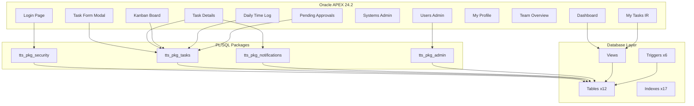

# Walkthrough — Daily Tasks Tracking System (TTS) — Final

## Summary

The Daily Tasks Tracking System is now **complete** with full database backend and APEX application blueprint. All files have been uploaded to GitHub.

**Repository:** [https://github.com/sbykemo/Tasks-system](https://github.com/sbykemo/Tasks-system)

---

## All Deliverables

### Phase 1: Database Backend (7 files)

| # | File | Contents |
|---|---|---|
| 1 | [install.sql](file:///c:/Users/develop4/Documents/Tasks%20system/install.sql) | Master installation script — runs all scripts in order |
| 2 | [schema.sql](file:///c:/Users/develop4/Documents/Tasks%20system/schema.sql) | 12 tables, 1 sequence, 17 indexes, all constraints |
| 3 | [seed_data.sql](file:///c:/Users/develop4/Documents/Tasks%20system/seed_data.sql) | 23 lookups, 3 departments, 3 systems, 10 tags, admin user |
| 4 | [views.sql](file:///c:/Users/develop4/Documents/Tasks%20system/views.sql) | 5 database views for reporting and dashboards |
| 5 | [triggers.sql](file:///c:/Users/develop4/Documents/Tasks%20system/triggers.sql) | 6 triggers (timestamps, task numbering, hours calc) |
| 6 | [packages.sql](file:///c:/Users/develop4/Documents/Tasks%20system/packages.sql) | 4 PL/SQL packages with ~25 procedures/functions |
| 7 | [test_suite.sql](file:///c:/Users/develop4/Documents/Tasks%20system/test_suite.sql) | 12 test groups, 45+ automated assertions |

### Phase 2: APEX Application Blueprint (3 files)

| # | File | Contents |
|---|---|---|
| 8 | [apex_shared_components.sql](file:///c:/Users/develop4/Documents/Tasks%20system/apex_shared_components.sql) | LOV queries, authorization schemes, authentication setup, navigation menu, custom CSS theme |
| 9 | [apex_pages_guide.sql](file:///c:/Users/develop4/Documents/Tasks%20system/apex_pages_guide.sql) | Complete page-by-page guide for all 15 APEX pages with SQL, PL/SQL, Dynamic Actions |
| 10 | [README.md](file:///c:/Users/develop4/Documents/Tasks%20system/README.md) | Professional project documentation |

---

## Quick Start Workflow

### Step 1: Install Database
```sql
GRANT EXECUTE ON DBMS_CRYPTO TO your_schema;
SQL> @install.sql
SQL> @test_suite.sql    -- Validate
```

### Step 2: Create APEX Application
1. Open APEX Builder → Create Application
2. Name: **Daily Tasks Tracking System** | Alias: **TTS**
3. Theme: **Universal Theme 42**

### Step 3: Setup Authentication
1. Shared Components → Authentication Schemes → Create
2. Type: **Custom**
3. Authentication Function: `tts_pkg_security.authenticate_user`
4. Post-Authentication: `tts_pkg_security.post_auth`

### Step 4: Create Application Items
| Item | Scope |
|---|---|
| `F_USER_ID` | Application |
| `F_USER_ROLE` | Application |
| `F_FULL_NAME` | Application |
| `F_DEPT_ID` | Application |

### Step 5: Create Authorization Schemes
| Name | PL/SQL |
|---|---|
| `IS_ADMIN` | `RETURN :F_USER_ROLE = 'ADMIN';` |
| `IS_MANAGER_OR_ADMIN` | `RETURN :F_USER_ROLE IN ('ADMIN','MANAGER');` |
| `IS_AUTHENTICATED` | `RETURN :F_USER_ROLE IS NOT NULL;` |

### Step 6: Create Shared LOVs
Copy LOV queries from [apex_shared_components.sql](file:///c:/Users/develop4/Documents/Tasks%20system/apex_shared_components.sql)

### Step 7: Build Pages
Follow [apex_pages_guide.sql](file:///c:/Users/develop4/Documents/Tasks%20system/apex_pages_guide.sql) page by page. Each page section contains:
- Source SQL queries
- Page items with types and LOVs
- PL/SQL processes
- Validations
- Dynamic Actions
- Button configurations
- Authorization conditions

### Step 8: Add Custom CSS
Copy CSS from `apex_shared_components.sql` into:
Shared Components → User Interface → CSS → Inline CSS

---

## System Architecture



---

> [!TIP]
> **Default Login:** `admin` / `Admin@123` — Change immediately after first login!
